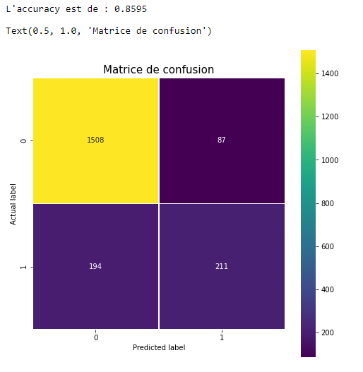
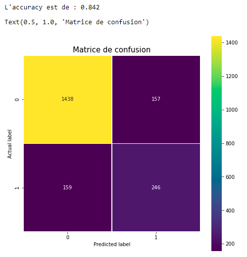

# taux_desabonnement

Pour le projet, j'ai dans un premier temps utilisé un RandomForestClassifier
Ensuite je suis passé sur un réseau de neurones. 

J'ai pu remarquer que les résultats restent proches entre les 2 avec une acuracy d'environ 86%.

 

Comme on peut le constater, le modèle arrive assez bien à classer les abonnés ne souhaitant pas se désinscrire (classe 0) contrairement à ceux voulant se désinscrire (classe 1) où l'on observe un peu plus de 50% de réussite de classement. 
Cette dernière partie varie énormément en fonction du paramétrage. Néanmoins, lorsque j'arrive à avoir un score 'correct' pour ce dernier, cela se répercute sur la classe 0 comme on peut le constater sur l'image suivante. 

 

Le meilleur score obtenu est de 86%. Ce qui va changer le plus c'est la réussite de classement de la classe 1. Et ce même en augmentant la taille du jeu de donné (testé en multipliant par 5) ou en changeant d'optimizer.
